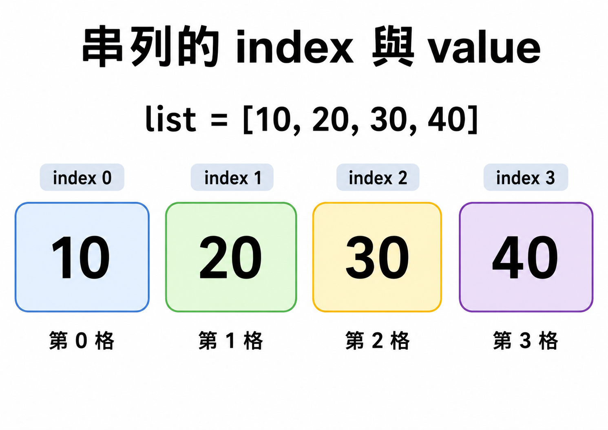
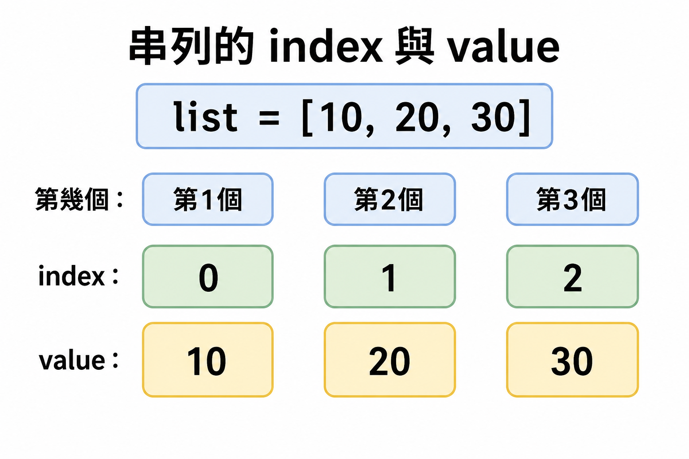
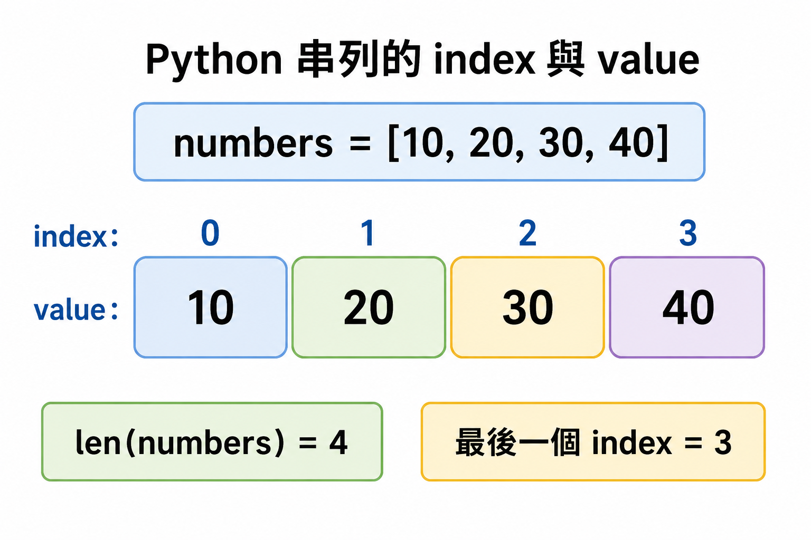
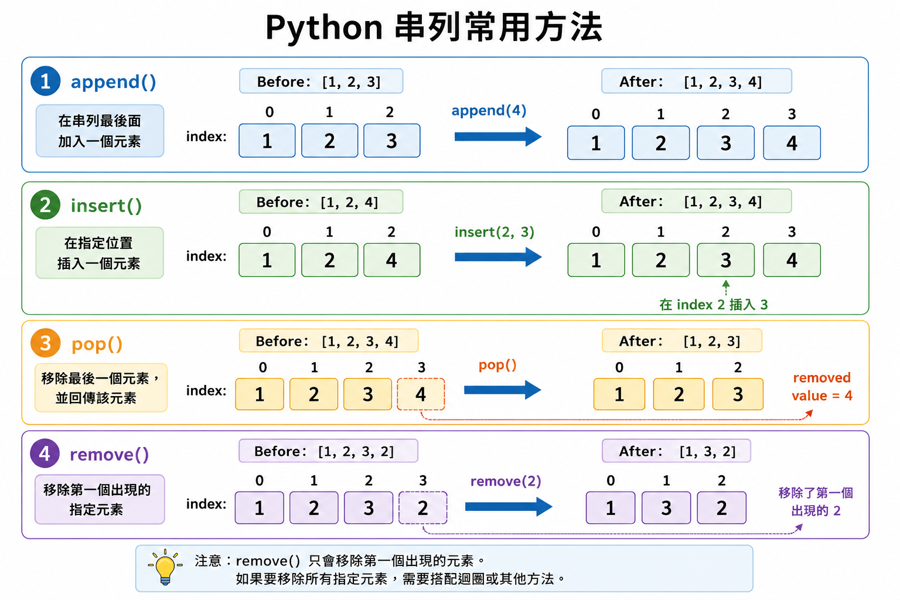
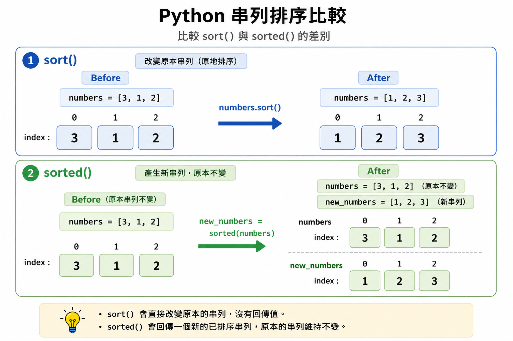
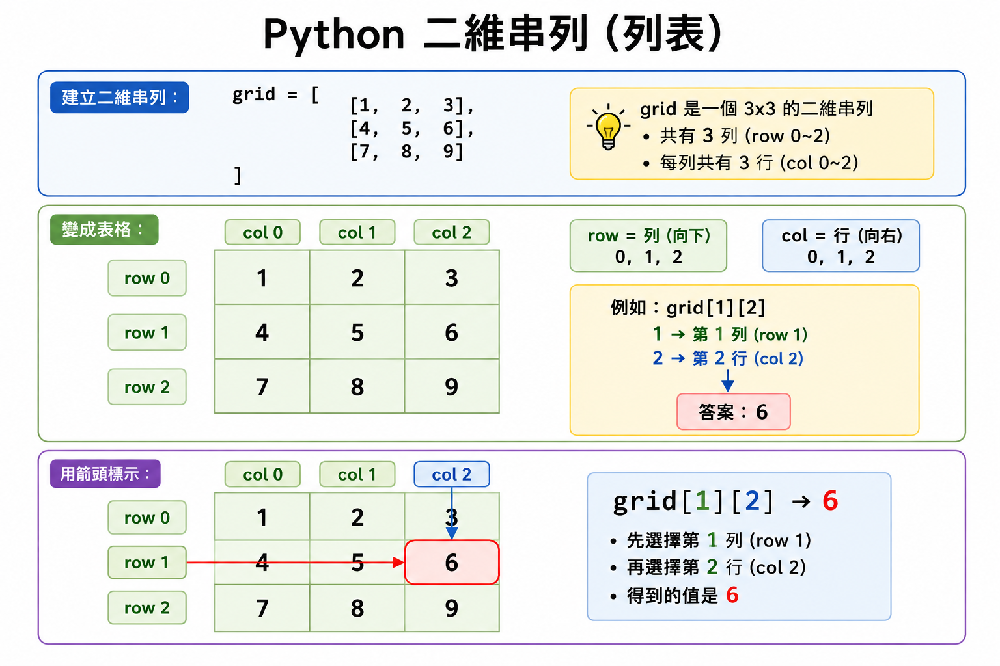

# Lesson 09: 串列 List

串列可以一次存放很多資料，之後可以用位置編號把資料取出、修改、新增或刪除。

> 這堂課的重點：認識串列、使用 index 取值、學會常見串列函式與方法，並理解多維串列的基本概念。
> 

---

## Section I. 今天要做什麼？

1. 認識什麼是串列。
2. 學會建立串列與空串列。
3. 學會使用 index 取得串列中的資料。
4. 學會使用 `len()`、`max()`、`min()`、`sum()`。
5. 學會使用常見串列方法，例如 `append()`、`pop()`、`sort()`。
6. 認識多維串列的基本寫法。
7. 練習用串列整理資料。

---

## Section II. 今天的學習方式

串列可以想像成一列火車。

每個車廂都可以放資料，而每個車廂都有自己的位置編號。

<p align="center">
  
</p>

```
位置 index： 0   1   2   3
資料 value：10  20  30  40
```

不用一開始就記住所有方法，先做到：

1. 知道串列用 `[]` 建立。
2. 知道串列的位置從 `0` 開始。
3. 可以用 `list_name[index]` 取出資料。
4. 可以用常見函式取得串列資訊。
5. 可以用常見方法修改串列內容。

---

## Section III. 今天會學到的內容

| 主題 | 你需要知道的事 |
| --- | --- |
| list | 可以存放多個資料的資料型態 |
| index | 串列中每個元素的位置編號，從 0 開始 |
| element | 串列中的每一個資料 |
| empty list | 裡面沒有資料的串列，例如 `[]` |
| list function | 取得串列資訊，通常不改變原串列 |
| list method | 串列自己的功能，常常會改變原串列 |
| 2D list | 串列裡面還有串列 |

---

## Section IV. 寫題目前的提醒

### 1. 串列位置從 0 開始

很多初學者會以為第一個資料的位置是 1，但 Python 串列的第一個位置是 0。

<p align="center">
  
</p>

```python
numbers = [10, 20, 30]

print(numbers[0])
print(numbers[1])
print(numbers[2])
```

Result:

```
10
20
30
```

---

### 2. 注意變數名稱要一致

如果串列叫做 `list1`，取值時也要寫 `list1`。

Wrong:

```python
list1 = [1, 2, 3]
print(list[0])
```

Correct:

```python
list1 = [1, 2, 3]
print(list1[0])
```

---

### 3. 注意 index 不可以超過範圍

```python
numbers = [10, 20, 30]
print(numbers[3])
```

這會出錯，因為 `numbers` 只有三個元素，位置只有 `0, 1, 2`。

---

### 4. 分清楚「函式」和「方法」

函式通常這樣用：

```python
len(numbers)
sum(numbers)
```

方法通常這樣用：

```python
numbers.append(4)
numbers.sort()
```

方法前面會先寫串列名稱，再接 `.方法名稱()`。

---

## Section V. 核心概念說明

### 1. 什麼是串列？

串列（list）是一種 Python 的資料型態，可以一次存放很多資料。

```python
list1 = [1, 2, 3, 4, 5]
print(list1)
```

Result:

```
[1, 2, 3, 4, 5]
```

串列可以放不同型態的資料。

```python
data = ["Amy", 15, True, [1, 2, 3]]
print(data)
```

Result:

```
['Amy', 15, True, [1, 2, 3]]
```

不過在初學階段，建議同一個串列盡量放同類型資料，會比較好理解。

---

### 2. 建立串列

建立串列時，使用中括號 `[]`，每個資料中間用逗號隔開。

```python
list1 = [1, 2, 3, 4, 5]
print(list1)
```

Result:

```
[1, 2, 3, 4, 5]
```

如果要建立一個包含 1 到 10 的串列：

```python
list1 = [1, 2, 3, 4, 5, 6, 7, 8, 9, 10]
print(list1)
```

Result:

```
[1, 2, 3, 4, 5, 6, 7, 8, 9, 10]
```

---

### 3. 空串列

空串列就是裡面沒有任何資料的串列。

```python
list1 = []
print(list1)
```

Result:

```
[]
```

當我們還不知道之後會放幾個資料時，可以先建立空串列。

```python
scores = []
scores.append(80)
scores.append(95)

print(scores)
```

Result:

```
[80, 95]
```

---

### 4. 串列取值

使用 `list_name[index]` 可以取得串列中指定位置的值。

```python
list1 = [1, 2, 3, 4]

print(list1[2])
```

Result:

```
3
```

因為位置從 0 開始：

| index | value |
| --- | --- |
| `0` | `1` |
| `1` | `2` |
| `2` | `3` |
| `3` | `4` |

---

### 5. 取出指定位置的值

如果要從 1 到 10 的串列中取出 4 和 7：

```python
list1 = [1, 2, 3, 4, 5, 6, 7, 8, 9, 10]

print(list1[3], list1[6])
```

Result:

```
4 7
```

注意：數字 `4` 在 index `3`，數字 `7` 在 index `6`。

---

### 6. 串列長度

使用 `len(list_name)` 可以取得串列長度。

<p align="center">
  
</p>

```python
list1 = [1, 2, 3, 4]

print(len(list1))
```

Result:

```
4
```

串列長度是元素數量，不是最後一個 index。

```
長度是 4
最後一個 index 是 3
```

---

### 7. 常見串列函式

串列函式通常用來取得串列資訊，通常不會改變原串列內容。

| 函式 | 功能 |
| --- | --- |
| `len(list_name)` | 取得串列長度 |
| `max(list_name)` | 取得最大值 |
| `min(list_name)` | 取得最小值 |
| `sum(list_name)` | 取得總和 |
| `tuple(list_name)` | 將串列轉換為元組 |

例如：

```python
list1 = [1, 2, 3, 4, 5]

print(len(list1))
print(max(list1))
print(min(list1))
print(sum(list1))
```

Result:

```
5
5
1
15
```

---

### 8. 求最大值、最小值、總和

```python
list1 = [1, 2, 3, 4, 5, 6, 7, 8, 9, 10]

print(max(list1), min(list1), sum(list1))
```

Result:

```
10 1 55
```

如果要算平均，可以用：

```python
list1 = [1, 2, 3, 4, 5]

average = sum(list1) / len(list1)
print(average)
```

Result:

```
3.0
```

---

### 9. 常見串列方法

串列方法是串列自己的功能，常常會改變原本的串列內容。

<p align="center">
  
</p>

| 方法 | 功能 |
| --- | --- |
| `list.append(element)` | 在串列最後加入元素 |
| `list.count(element)` | 計算某元素出現幾次 |
| `list.index(element)` | 找出某元素第一次出現的位置 |
| `list.insert(position, element)` | 在指定位置插入元素 |
| `list.pop()` | 移除並回傳最後一個元素 |
| `list.remove(element)` | 移除指定元素 |
| `list.reverse()` | 反轉原串列 |
| `del list_name[start:end:interval]` | 刪除指定範圍的元素 |
| `list.sort()` | 排序並改變原串列 |
| `sorted(list_name)` | 排序並建立新串列 |

---

### 10. `append()`：新增元素

```python
numbers = [1, 2, 3]
numbers.append(4)

print(numbers)
```

Result:

```
[1, 2, 3, 4]
```

`append()` 會把新元素加到串列最後。

---

### 11. `insert()`：插入元素

```python
numbers = [1, 2, 4]
numbers.insert(2, 3)

print(numbers)
```

Result:

```
[1, 2, 3, 4]
```

`insert(2, 3)` 代表在 index `2` 的位置插入 `3`。

---

### 12. `pop()`：刪除最後一個元素

```python
numbers = [1, 2, 3, 4]
x = numbers.pop()

print(numbers)
print(x)
```

Result:

```
[1, 2, 3]
4
```

`pop()` 會移除最後一個元素，也會把被移除的元素回傳。

---

### 13. `remove()`：刪除指定元素

```python
numbers = [1, 2, 3, 2]
numbers.remove(2)

print(numbers)
```

Result:

```
[1, 3, 2]
```

`remove(2)` 只會刪除第一個出現的 `2`。

---

### 14. `reverse()`：反轉串列

```python
numbers = [1, 2, 3, 4]
numbers.reverse()

print(numbers)
```

Result:

```
[4, 3, 2, 1]
```

`reverse()` 會改變原本的串列。

---

### 15. `sort()` 和 `sorted()`

<p align="center">
  
</p>

`sort()` 會改變原本的串列。

```python
numbers = [3, 1, 4, 2]
numbers.sort()

print(numbers)
```

Result:

```
[1, 2, 3, 4]
```

`sorted()` 會產生新的排序結果，不會改變原本串列。

```python
numbers = [3, 1, 4, 2]
new_numbers = sorted(numbers)

print(numbers)
print(new_numbers)
```

Result:

```
[3, 1, 4, 2]
[1, 2, 3, 4]
```

注意：沒有 `list.sorted()` 這種寫法。

---

### 16. 反轉後刪除最後一項

```python
list1 = [1, 2, 3, 4, 5, 6, 7, 8, 9, 10]

list1.reverse()
list1.pop()

print(list1)
```

Result:

```
[10, 9, 8, 7, 6, 5, 4, 3, 2]
```

先反轉後，串列變成：

```
[10, 9, 8, 7, 6, 5, 4, 3, 2, 1]
```

再使用 `pop()` 刪除最後一項，也就是 `1`。

---

### 17. 多維串列

<p align="center">
  
</p>

多維串列就是串列裡面還有串列。

```python
grid = [
    [1, 2, 3],
    [4, 5, 6],
    [7, 8, 9]
]

print(grid)
```

Result:

```
[[1, 2, 3], [4, 5, 6], [7, 8, 9]]
```

可以把它想成表格：

```
row 0: 1 2 3
row 1: 4 5 6
row 2: 7 8 9
```

---

### 18. 多維串列取值

如果要取出 `6`：

```python
grid = [
    [1, 2, 3],
    [4, 5, 6],
    [7, 8, 9]
]

print(grid[1][2])
```

Result:

```
6
```

`grid[1]` 先取出第二列：

```
[4, 5, 6]
```

`grid[1][2]` 再取出這一列的 index `2`，也就是 `6`。

---

## Section VI. 快速概念檢查

請先不要急著執行，先用眼睛看，猜猜看答案。

### Q1. index 從哪裡開始？

```python
numbers = [10, 20, 30]
print(numbers[0])
```

Question:
你覺得結果會是什麼？

Answer:

```
10
```

Explanation:
串列第一個元素的位置是 `0`。

---

### Q2. 取出第三個元素

```python
items = ["a", "b", "c", "d"]
print(items[2])
```

Question:
你覺得結果會是什麼？

Answer:

```
c
```

Explanation:
index `2` 是第三個元素。

---

### Q3. 串列長度

```python
scores = [80, 90, 100]
print(len(scores))
```

Question:
你覺得結果會是什麼？

Answer:

```
3
```

Explanation:
串列中有三個元素，所以長度是 `3`。

---

### Q4. `append()`

```python
numbers = [1, 2]
numbers.append(3)
print(numbers)
```

Question:
你覺得結果會是什麼？

Answer:

```
[1, 2, 3]
```

Explanation:
`append(3)` 會把 `3` 加到串列最後。

---

### Q5. `pop()`

```python
numbers = [1, 2, 3]
x = numbers.pop()
print(numbers)
print(x)
```

Question:
你覺得結果會是什麼？

Answer:

```
[1, 2]
3
```

Explanation:
`pop()` 會移除最後一個元素，並回傳被移除的元素。

---

## Section VII. 程式閱讀練習

### 題目 1：修改串列

```python
numbers = [1, 2, 3]
numbers.append(4)
numbers.append(5)
print(numbers)
```

思考方式：

```
原本是 [1, 2, 3]。
append(4) 後變成 [1, 2, 3, 4]。
append(5) 後變成 [1, 2, 3, 4, 5]。
```

所以答案是：

```
[1, 2, 3, 4, 5]
```

---

### 題目 2：取值與長度

```python
data = [5, 10, 15, 20]

print(data[1])
print(len(data))
```

思考方式：

```
data[1] 是第二個元素，也就是 10。
data 中有 4 個元素，所以 len(data) 是 4。
```

所以答案是：

```
10
4
```

---

### 題目 3：排序與反轉

```python
numbers = [3, 1, 4, 2]
numbers.sort()
numbers.reverse()

print(numbers)
```

思考方式：

```
sort() 後變成 [1, 2, 3, 4]。
reverse() 後變成 [4, 3, 2, 1]。
```

所以答案是：

```
[4, 3, 2, 1]
```

---

### 題目 4：`sort()` 和 `sorted()`

```python
numbers = [3, 1, 2]
new_numbers = sorted(numbers)

print(numbers)
print(new_numbers)
```

思考方式：

```
sorted(numbers) 會建立新的排序結果，不會改變原本 numbers。
所以 numbers 還是 [3, 1, 2]。
new_numbers 是 [1, 2, 3]。
```

所以答案是：

```
[3, 1, 2]
[1, 2, 3]
```

---

### 題目 5：多維串列

```python
grid = [
    [1, 2],
    [3, 4],
    [5, 6]
]

print(grid[2][1])
```

思考方式：

```
grid[2] 是第三列，也就是 [5, 6]。
grid[2][1] 是這一列的第二個元素，也就是 6。
```

所以答案是：

```
6
```

---

## Section VIII. 實作練習 / 實作檢測題

請完成下面函式。這一區不提供完整解答，請先自己試著寫。

### Q1. 回傳串列長度

完成函式：

```python
def q1_list_length(items):
    #TODO: 回傳 items 的長度
    return None
```

Example:

```python
q1_list_length([1, 2, 3])
```

應該回傳：

```
3
```

---

### Q2. 回傳第一個元素

完成函式：

```python
def q2_first_item(items):
    #TODO: 回傳 items 的第一個元素
    return None
```

Example:

```python
q2_first_item([10, 20, 30])
```

應該回傳：

```
10
```

---

### Q3. 回傳最後一個元素

完成函式：

```python
def q3_last_item(items):
    #TODO: 回傳 items 的最後一個元素
    return None
```

Example:

```python
q3_last_item([10, 20, 30])
```

應該回傳：

```
30
```

---

### Q4. 回傳最大值

完成函式：

```python
def q4_max_value(numbers):
    #TODO: 回傳 numbers 中的最大值
    return None
```

Example:

```python
q4_max_value([3, 9, 2])
```

應該回傳：

```
9
```

---

### Q5. 回傳總和

完成函式：

```python
def q5_sum_values(numbers):
    #TODO: 回傳 numbers 中所有數字的總和
    return None
```

Example:

```python
q5_sum_values([1, 2, 3, 4])
```

應該回傳：

```
10
```

---

### Q6. 新增元素後回傳串列

完成函式：

```python
def q6_append_item(items, x):
    #TODO: 把 x 加到 items 最後，並回傳 items
    return None
```

Example:

```python
q6_append_item([1, 2], 3)
```

應該回傳：

```
[1, 2, 3]
```

---

### Q7. 排序後回傳串列

完成函式：

```python
def q7_sort_list(numbers):
    #TODO: 將 numbers 排序後回傳
    return None
```

Example:

```python
q7_sort_list([3, 1, 2])
```

應該回傳：

```
[1, 2, 3]
```

---

### Q8. 反轉後回傳串列

完成函式：

```python
def q8_reverse_list(items):
    #TODO: 將 items 反轉後回傳
    return None
```

Example:

```python
q8_reverse_list([1, 2, 3])
```

應該回傳：

```
[3, 2, 1]
```

---

### Q9. 計算平均

完成函式：

```python
def q9_average(numbers):
    #TODO: 回傳 numbers 的平均值
    return None
```

Example:

```python
q9_average([2, 4, 6])
```

應該回傳：

```
4.0
```

---

### Q10. 取出二維串列中的資料

完成函式：

```python
def q10_get_grid_value(grid, row, col):
    #TODO: 回傳 grid[row][col]
    return None
```

Example:

```python
q10_get_grid_value([[1, 2], [3, 4]], 1, 0)
```

應該回傳：

```
3
```

---

## Section IX. 做題時可以使用的提示

### 1. 使用 index 取值

```python
items[0]
items[1]
```

第一個元素是 index `0`。

---

### 2. 取得最後一個元素

```python
items[-1]
```

- `1` 可以取得最後一個元素。

---

### 3. 使用 `len()`

```python
len(items)
```

可以取得串列中有幾個元素。

---

### 4. 使用 `append()`

```python
items.append(x)
```

可以把 `x` 加到串列最後。

---

### 5. 使用 `sort()`

```python
numbers.sort()
```

會直接改變原本的 `numbers`。

---

### 6. 使用 `sorted()`

```python
new_numbers = sorted(numbers)
```

會建立新的排序結果，不會改變原本的 `numbers`。

---

### 7. 計算平均

```python
sum(numbers) / len(numbers)
```

總和除以數量就是平均。

---

### 8. 二維串列取值

```python
grid[row][col]
```

第一個中括號選第幾列，第二個中括號選該列中的第幾個元素。

---

## Section X. 課後小練習

### 練習 1：新增並排序

寫一個函式：

```python
def add_and_sort(numbers, x):
    return None
```

將 `x` 加入 `numbers`，排序後回傳。

Example:

```python
add_and_sort([3, 1, 2], 4)
```

應該回傳：

```
[1, 2, 3, 4]
```

---

### 練習 2：刪除最後一個元素

寫一個函式：

```python
def remove_last(items):
    return None
```

刪除 `items` 的最後一個元素後，回傳修改後的串列。

Example:

```python
remove_last([1, 2, 3])
```

應該回傳：

```
[1, 2]
```

---

### 練習 3：回傳最大值和最小值

寫一個函式：

```python
def max_and_min(numbers):
    return None
```

回傳一個串列，內容是最大值和最小值。

Example:

```python
max_and_min([3, 9, 1, 5])
```

應該回傳：

```
[9, 1]
```

---

### 練習 4：計算第二列總和

寫一個函式：

```python
def second_row_sum(grid):
    return None
```

`grid` 是二維串列，請回傳第二列的總和。

Example:

```python
second_row_sum([[1, 2], [3, 4], [5, 6]])
```

應該回傳：

```
7
```

---

### 練習 5：綜合練習

給定串列：

```python
list1 = [24, 54, 12, 56, 78, 89]
```

請完成以下步驟：

1. 新增 `12`、`13`、`15`。
2. 將串列排序。
3. 將串列反轉。
4. 刪除第 4 項。
5. 刪除最後一項。
6. 輸出最大值、最小值、總和、平均。

提醒：第 4 項的 index 是 `3`。

---

## Section XI. 重點複習

| 重點 | 說明 |
| --- | --- |
| `[]` | 用來建立串列 |
| index | 串列位置，從 `0` 開始 |
| `list_name[index]` | 取得指定位置的資料 |
| `len(list_name)` | 取得串列長度 |
| `append()` | 在最後新增元素 |
| `pop()` | 移除最後一個元素 |
| `remove()` | 移除指定元素 |
| `sort()` | 排序並改變原串列 |
| `sorted()` | 建立新的排序結果 |
| `list[row][col]` | 二維串列取值 |

---

## Section XII. 常見錯誤提醒

### 1. 把第一個位置當成 1

Wrong:

```python
numbers = [10, 20, 30]
print(numbers[1])
```

如果你想取出第一個元素，這樣會取到第二個元素。

Correct:

```python
numbers = [10, 20, 30]
print(numbers[0])
```

---

### 2. index 超出範圍

Wrong:

```python
numbers = [10, 20, 30]
print(numbers[3])
```

`numbers` 的 index 只有 `0, 1, 2`，沒有 `3`。

Correct:

```python
numbers = [10, 20, 30]
print(numbers[2])
```

---

### 3. 變數名稱寫錯

Wrong:

```python
list1 = [1, 2, 3]
print(list[0])
```

這裡的串列名稱是 `list1`，不是 `list`。

Correct:

```python
list1 = [1, 2, 3]
print(list1[0])
```

---

### 4. 誤用 `list.sorted()`

Wrong:

```python
numbers = [3, 1, 2]
numbers.sorted()
```

Python 沒有 `list.sorted()` 這種串列方法。

Correct 1：改變原串列

```python
numbers = [3, 1, 2]
numbers.sort()
print(numbers)
```

Correct 2：建立新串列

```python
numbers = [3, 1, 2]
new_numbers = sorted(numbers)
print(new_numbers)
```

---

### 5. 以為 `sort()` 會回傳新串列

Wrong:

```python
numbers = [3, 1, 2]
new_numbers = numbers.sort()
print(new_numbers)
```

`sort()` 會改變原串列，但不會回傳新的串列，所以 `new_numbers` 會是 `None`。

Correct:

```python
numbers = [3, 1, 2]
numbers.sort()
print(numbers)
```

---

### 6. 分不清楚 `append()` 和 `insert()`

`append()` 是加到最後。

```python
numbers = [1, 2, 3]
numbers.append(4)
print(numbers)
```

Result:

```
[1, 2, 3, 4]
```

`insert()` 是插入到指定位置。

```python
numbers = [1, 2, 4]
numbers.insert(2, 3)
print(numbers)
```

Result:

```
[1, 2, 3, 4]
```

---

## Section XIII. 小提醒

串列很適合用來整理一群相關資料，例如：

```
一群分數
一串名字
一堆商品價格
一張遊戲地圖
```

當你看到題目需要「存很多資料」、「找最大最小」、「加總」、「排序」、「刪除某些資料」時，就可以先想：

> 這題是不是可以用串列來處理？
>