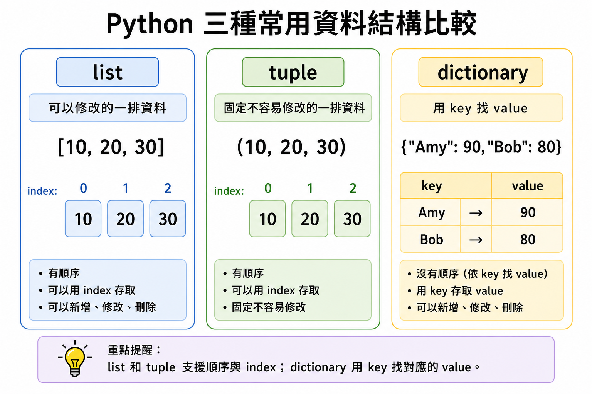
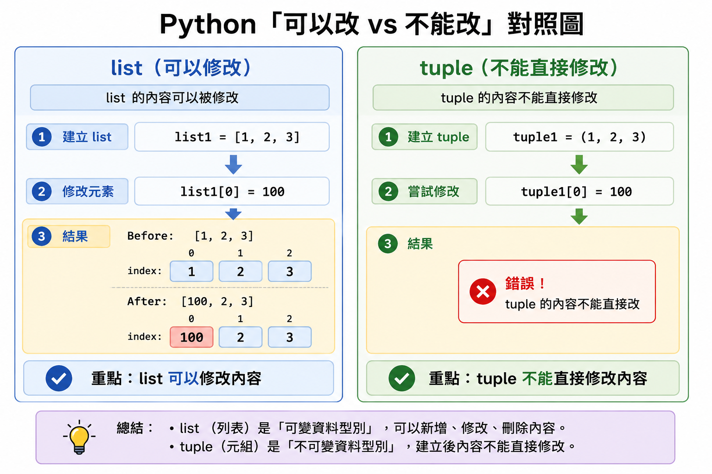
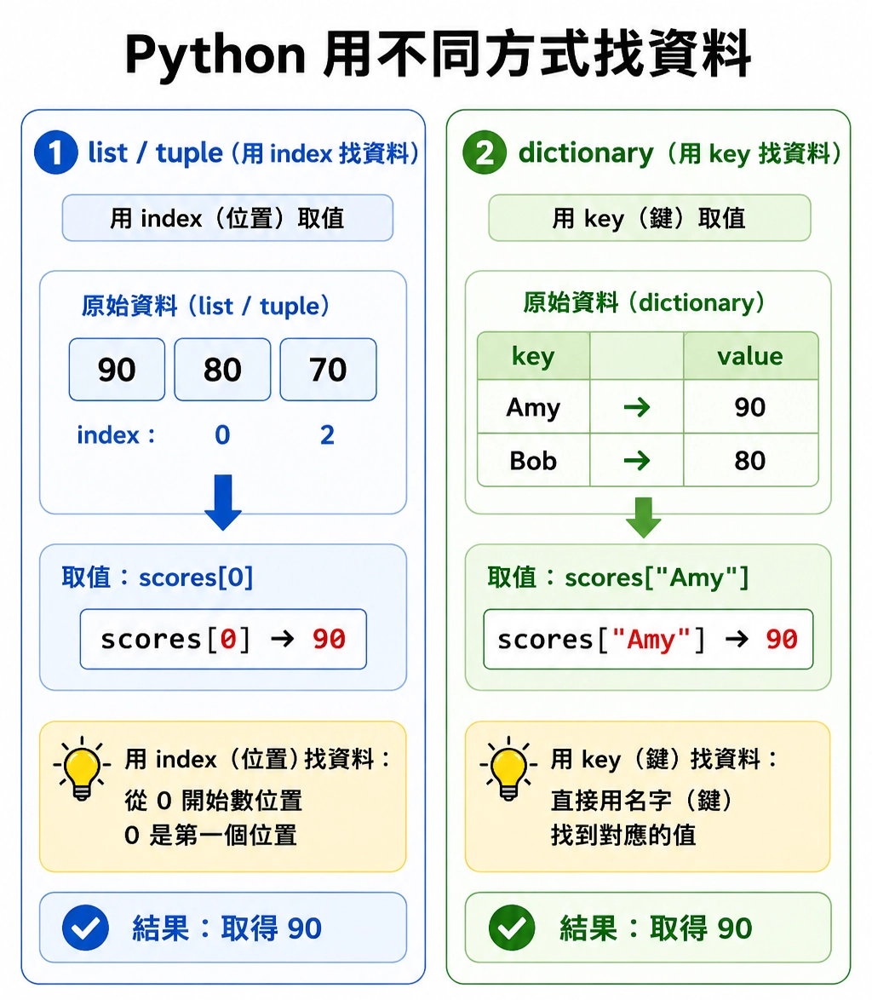
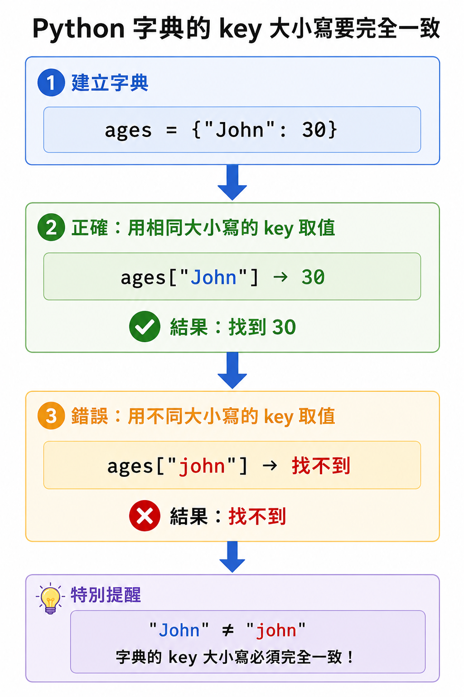
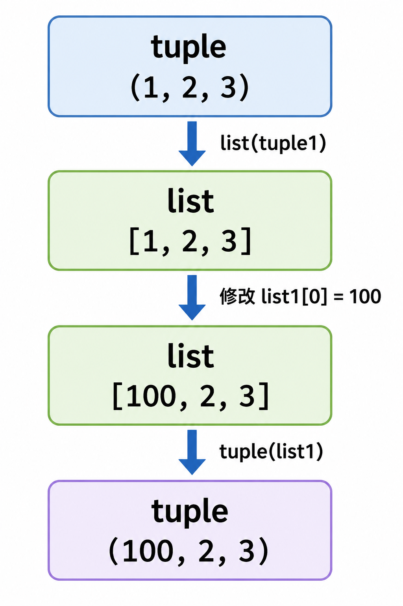
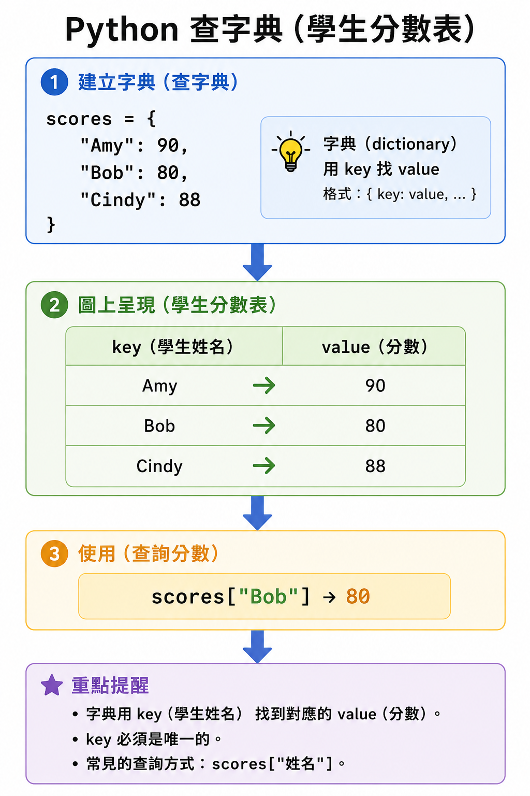
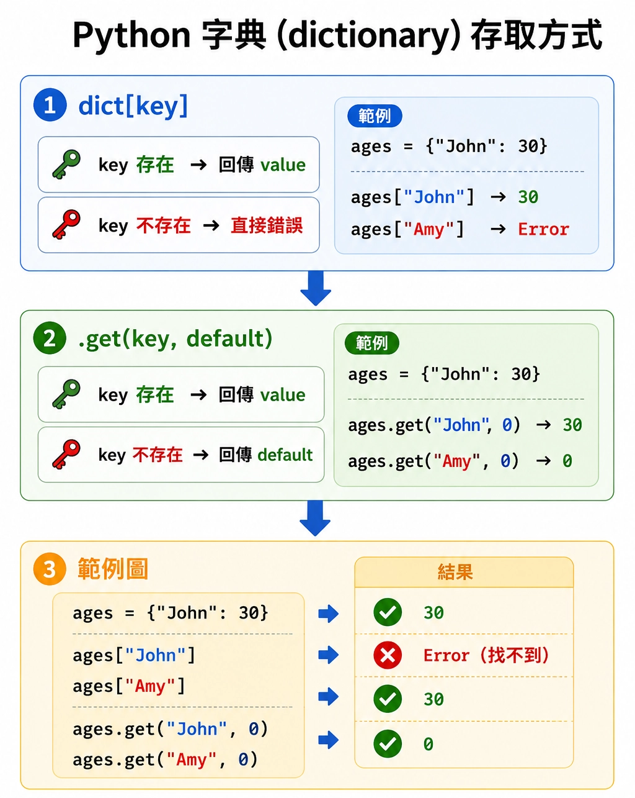
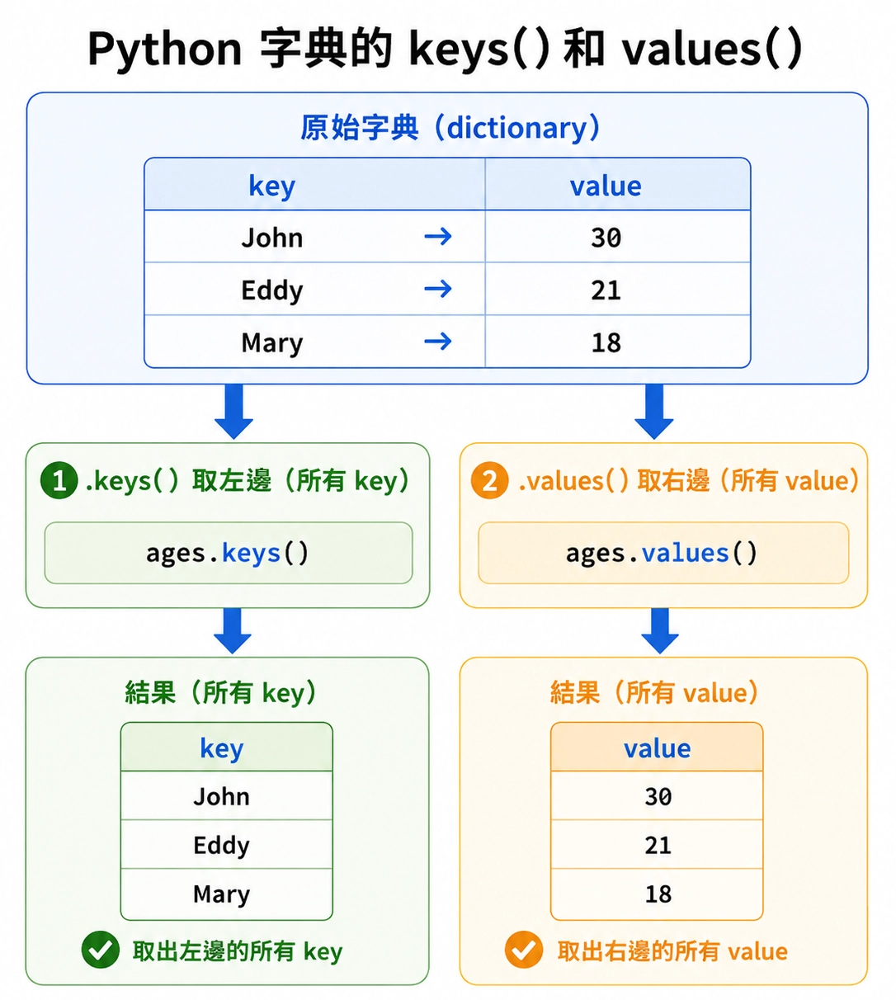
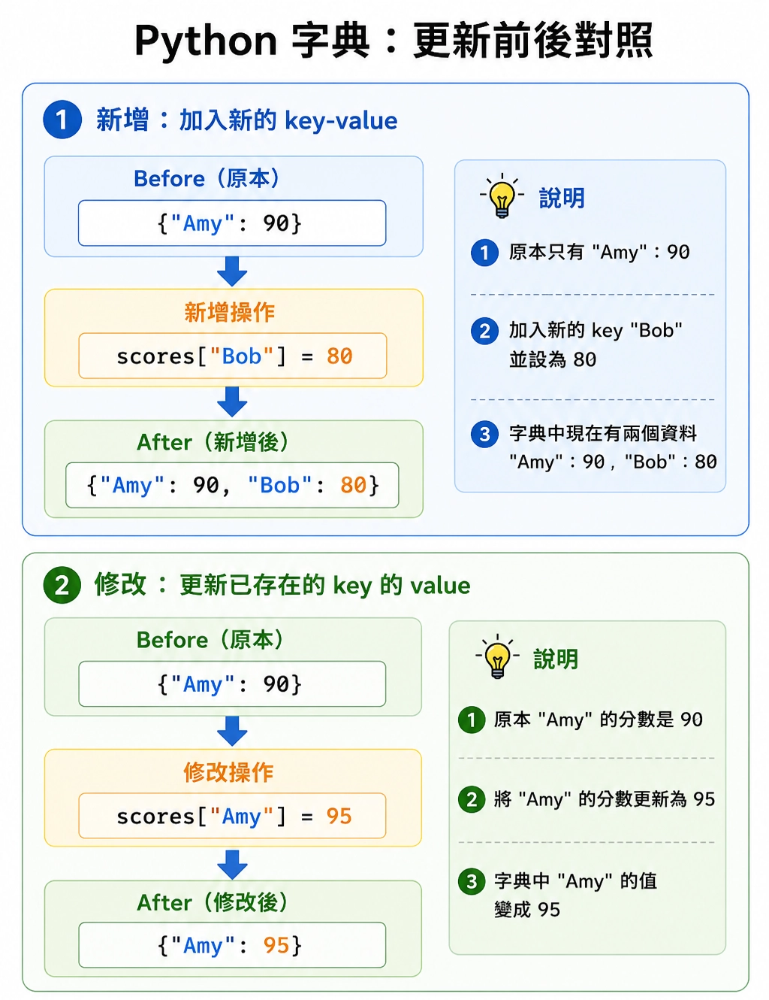

# Lesson 10: 元組 Tuple 與字典 Dictionary

元組（tuple）和字典（dictionary）都可以用來存放多筆資料，但使用情境和取資料的方法不同。

> 這堂課的重點：理解元組不可修改的特性，並學會用 key 從字典中取得資料。
> 

---

## Section I. 今天要做什麼？

1. 認識什麼是元組（tuple）。
2. 比較元組和串列（list）的差異。
3. 學會建立元組與取值。
4. 認識什麼是字典（dictionary）。
5. 學會使用 key 和 value 儲存資料。
6. 學會使用 `dict_name[key]` 和 `.get()` 取得資料。
7. 練習使用元組和字典整理資料。

---

## Section II. 今天的學習方式

前一課我們學過串列（list），串列可以存放多筆資料，也可以修改內容。

<p align="center">
  
</p>

這一課會學到：

1. 元組（tuple）：像是不能修改的串列。
2. 字典（dictionary）：用 key 找資料，不是用位置找資料。

可以先用這個方式理解：

| 資料型態 | 想像方式 |
| --- | --- |
| list | 可以改座位的自由座火車 |
| tuple | 座位固定的對號座火車 |
| dictionary | 查字典，用關鍵字找到對應意思 |

不用一開始就記住所有方法，先把「怎麼建立」和「怎麼取資料」學會。

---

## Section III. 今天會學到的內容

| 主題 | 你需要知道的事 |
| --- | --- |
| tuple | 可以存多筆資料，但建立後通常不能修改 |
| index | tuple 和 list 一樣可以用位置取值 |
| dictionary | 使用 key 找到 value 的資料結構 |
| key | 字典中的關鍵字 |
| value | key 對應到的資料 |
| `.get()` | 安全取得字典資料的方法 |
| `.keys()` | 取得字典中所有 key |

---

## Section IV. 寫題目前的提醒

<p align="center">
  
</p>

### 1. tuple 和 list 很像，但不能直接修改元素

```python
list1 = [1, 2, 3]
tuple1 = (1, 2, 3)
```

`list1` 可以修改：

```python
list1[0] = 100
```

但是 `tuple1` 不能這樣修改：

```python
tuple1[0] = 100
```

這會產生錯誤。

---

### 2. dictionary 不是用位置取值

<p align="center">
  
</p>

串列和元組通常用 index 取值：

```python
numbers = [10, 20, 30]
print(numbers[0])
```

字典是用 key 取值：

```python
ages = {"John": 30, "Mary": 18}
print(ages["John"])
```

---

### 3. 注意 key 要完全相同

<p align="center">
  
</p>

```python
ages = {"John": 30}

print(ages["john"])
```

這會出錯，因為 `"John"` 和 `"john"` 不一樣。

Python 會區分大小寫。

---

### 4. `.get()` 可以避免找不到 key 時直接出錯

```python
ages = {"John": 30}

print(ages.get("Mary", "not found"))
```

Result:

```
not found
```

如果 key 不存在，`.get()` 可以回傳預設值。

---

## Section V. 核心概念說明

### 1. 什麼是元組 tuple？

元組（tuple）和串列（list）一樣，都可以用來儲存多筆資料。

不同的是：tuple 建立後，裡面的元素通常不能被修改。

```python
list1 = [1, 2, 3, 4]
tuple1 = (1, 2, 3, 4)

print(list1)
print(tuple1)
```

Result:

```
[1, 2, 3, 4]
(1, 2, 3, 4)
```

串列使用 `[]`，元組使用 `()`。

---

### 2. tuple 取值

tuple 和 list 一樣，可以用 index 取值。

```python
tuple1 = (1, 2, 3, 4)

print(tuple1[0])
print(tuple1[2])
```

Result:

```
1
3
```

位置一樣從 `0` 開始。

| index | value |
| --- | --- |
| `0` | `1` |
| `1` | `2` |
| `2` | `3` |
| `3` | `4` |

---

### 3. tuple 不能直接修改元素

<p align="center">
  
</p>

```python
tuple1 = (1, 2, 3, 4)

tuple1[0] = 100
```

這段程式會出錯，因為 tuple 的內容不能直接修改。

如果真的需要修改，可以先轉成 list。

```python
tuple1 = (1, 2, 3, 4)

list1 = list(tuple1)
list1[0] = 100
tuple1 = tuple(list1)

print(tuple1)
```

Result:

```
(100, 2, 3, 4)
```

---

### 4. tuple 常見函式

tuple 可以使用一些和 list 類似的函式。

| 函式 | 功能 |
| --- | --- |
| `len(tuple_name)` | 取得元組長度 |
| `max(tuple_name)` | 取得最大值 |
| `min(tuple_name)` | 取得最小值 |
| `sum(tuple_name)` | 取得總和 |
| `list(tuple_name)` | 將元組轉換為串列 |

Example:

```python
tuple1 = (1, 2, 3, 4, 5)

print(len(tuple1))
print(max(tuple1))
print(min(tuple1))
print(sum(tuple1))
```

Result:

```
5
5
1
15
```

---

### 5. tuple 也有少數方法

雖然 tuple 不能像 list 一樣使用 `append()`、`pop()`、`sort()` 來改變內容，但 tuple 有少數不會修改內容的方法。

| 方法 | 功能 |
| --- | --- |
| `tuple.count(element)` | 計算某元素出現幾次 |
| `tuple.index(element)` | 找出某元素第一次出現的位置 |

Example:

```python
tuple1 = (1, 2, 2, 3)

print(tuple1.count(2))
print(tuple1.index(3))
```

Result:

```
2
3
```

重點：tuple 不能使用會改變內容的方法，例如 `append()`。

---

### 6. 什麼是字典 dictionary？

<p align="center">
  
</p>

字典（dictionary）也是一種儲存資料的方法。

list 和 tuple 是用位置 index 找資料：

```python
scores = [90, 80, 70]
print(scores[0])
```

dictionary 是用 key 找資料：

```python
ages = {"John": 30, "Eddy": 21, "Mary": 18}
print(ages["John"])
```

Result:

```
30
```

可以把 dictionary 想成真正的字典：

```
key：單字
value：意思
```

在 Python 字典中：

```
key：John
value：30
```

---

### 7. 建立字典

最常見的建立方式是使用 `{}`。

```python
dict1 = {"John": 30, "Eddy": 21, "Mary": 18}

print(dict1)
```

Result:

```
{'John': 30, 'Eddy': 21, 'Mary': 18}
```

格式是：

```python
dict_name = {
    key1: value1,
    key2: value2,
    key3: value3
}
```

每一組資料都是：

```
key: value
```

---

### 8. 使用 `dict()` 建立字典

也可以使用 `dict()` 建立字典。

方式一：使用 key-value pair 的串列。

```python
dict1 = dict([("John", 30), ("Eddy", 21), ("Mary", 18)])

print(dict1)
```

Result:

```
{'John': 30, 'Eddy': 21, 'Mary': 18}
```

方式二：使用 keyword argument。

```python
dict2 = dict(John=30, Eddy=21, Mary=18)

print(dict2)
```

Result:

```
{'John': 30, 'Eddy': 21, 'Mary': 18}
```

注意：這種寫法的 key 不需要加引號，但 key 必須是合法的變數名稱。

---

### 9. 字典取值：使用 key

<p align="center">
  
</p>

使用中括號和 key 可以取得對應的 value。

```python
dict1 = {"John": 30, "Eddy": 21, "Mary": 18}

print(dict1["John"])
print(dict1["Mary"])
```

Result:

```
30
18
```

如果 key 不存在，程式會出錯。

```python
dict1 = {"John": 30, "Eddy": 21, "Mary": 18}

print(dict1["Amy"])
```

這會產生錯誤，因為 `"Amy"` 不在字典中。

---

### 10. 字典取值：使用 `.get()`

`.get()` 也可以取得字典中的資料。

```python
dict1 = {"John": 30, "Eddy": 21, "Mary": 18}

print(dict1.get("John"))
```

Result:

```
30
```

`.get()` 的好處是：如果 key 不存在，可以設定預設值。

```python
dict1 = {"John": 30, "Eddy": 21, "Mary": 18}

print(dict1.get("Amy", "not found"))
```

Result:

```
not found
```

格式：

```python
dict_name.get(key, default_value)
```

---

### 11. 字典長度

使用 `len()` 可以取得字典中有幾組 key-value 資料。

```python
dict1 = {"John": 30, "Eddy": 21, "Mary": 18}

print(len(dict1))
```

Result:

```
3
```

---

### 12. 取得所有 key

使用 `.keys()` 可以取得字典中所有 key。

<p align="center">
  
</p>

```python
dict1 = {"John": 30, "Eddy": 21, "Mary": 18}

print(dict1.keys())
```

Result:

```
dict_keys(['John', 'Eddy', 'Mary'])
```

如果想轉成 list，可以使用 `list()`。

```python
dict1 = {"John": 30, "Eddy": 21, "Mary": 18}

keys = list(dict1.keys())
print(keys)
```

Result:

```
['John', 'Eddy', 'Mary']
```

---

### 13. 取得所有 value

雖然原始課程只列出 `.keys()`，但實際寫程式時 `.values()` 也很常用。

```python
dict1 = {"John": 30, "Eddy": 21, "Mary": 18}

print(dict1.values())
```

Result:

```
dict_values([30, 21, 18])
```

轉成 list：

```python
dict1 = {"John": 30, "Eddy": 21, "Mary": 18}

values = list(dict1.values())
print(values)
```

Result:

```
[30, 21, 18]
```

---

### 14. 字典新增與修改資料

<p align="center">
  
</p>

如果 key 不存在，會新增資料。

```python
scores = {"Amy": 90}
scores["Bob"] = 80

print(scores)
```

Result:

```
{'Amy': 90, 'Bob': 80}
```

如果 key 已經存在，會修改資料。

```python
scores = {"Amy": 90}
scores["Amy"] = 95

print(scores)
```

Result:

```
{'Amy': 95}
```

---

## Section VI. 快速概念檢查

請先不要急著執行，先用眼睛看，猜猜看答案。

### Q1. tuple 取值

```python
tuple1 = (10, 20, 30)

print(tuple1[1])
```

Question:
你覺得結果會是什麼？

Answer:

```
20
```

Explanation:
tuple 和 list 一樣，index 從 `0` 開始，所以 index `1` 是第二個元素。

---

### Q2. tuple 長度

```python
tuple1 = (1, 2, 3, 4)

print(len(tuple1))
```

Question:
你覺得結果會是什麼？

Answer:

```
4
```

Explanation:
tuple 裡面有 4 個元素。

---

### Q3. 字典取值

```python
ages = {"John": 30, "Mary": 18}

print(ages["Mary"])
```

Question:
你覺得結果會是什麼？

Answer:

```
18
```

Explanation:
`"Mary"` 這個 key 對應到的 value 是 `18`。

---

### Q4. `.get()` 找不到 key

```python
ages = {"John": 30}

print(ages.get("Amy", 0))
```

Question:
你覺得結果會是什麼？

Answer:

```
0
```

Explanation:
字典中沒有 `"Amy"`，所以 `.get()` 回傳預設值 `0`。

---

### Q5. 修改字典資料

```python
scores = {"Amy": 90}
scores["Amy"] = 95

print(scores["Amy"])
```

Question:
你覺得結果會是什麼？

Answer:

```
95
```

Explanation:
`"Amy"` 原本對應到 `90`，後來被改成 `95`。

---

## Section VII. 程式閱讀練習

### 題目 1：tuple 與 list 轉換

```python
tuple1 = (1, 2, 3)
list1 = list(tuple1)
list1.append(4)

print(list1)
print(tuple1)
```

思考方式：

```
tuple1 是 (1, 2, 3)。
list(tuple1) 會建立一個新的串列 [1, 2, 3]。
append(4) 只會改變 list1，不會改變 tuple1。
```

所以答案是：

```
[1, 2, 3, 4]
(1, 2, 3)
```

---

### 題目 2：tuple 的 `count()`

```python
data = (1, 2, 2, 3, 2)

print(data.count(2))
```

思考方式：

```
tuple 中的 2 出現了三次。
```

所以答案是：

```
3
```

---

### 題目 3：字典取值

```python
scores = {"Amy": 90, "Bob": 75, "Cindy": 88}

print(scores["Bob"])
print(scores.get("David", 0))
```

思考方式：

```
"Bob" 對應到 75。
"David" 不在字典中，所以 get("David", 0) 回傳 0。
```

所以答案是：

```
75
0
```

---

### 題目 4：新增字典資料

```python
scores = {"Amy": 90}
scores["Bob"] = 80
scores["Amy"] = 95

print(scores)
```

思考方式：

```
scores["Bob"] = 80 會新增一組資料。
scores["Amy"] = 95 會修改原本 Amy 的分數。
```

所以答案是：

```
{'Amy': 95, 'Bob': 80}
```

---

### 題目 5：字典 keys

```python
ages = {"John": 30, "Eddy": 21, "Mary": 18}

keys = list(ages.keys())
print(keys)
```

思考方式：

```
ages.keys() 會取得所有 key。
轉成 list 後會得到 ['John', 'Eddy', 'Mary']。
```

所以答案是：

```
['John', 'Eddy', 'Mary']
```

---

## Section VIII. 實作練習 / 實作檢測題

請完成下面函式。這一區不提供完整解答，請先自己試著寫。

### Q1. 回傳 tuple 長度

完成函式：

```python
def q1_tuple_length(data):
    #TODO: 回傳 tuple 的長度
    return None
```

Example:

```python
q1_tuple_length((1, 2, 3))
```

應該回傳：

```
3
```

---

### Q2. 回傳 tuple 第一個元素

完成函式：

```python
def q2_first_tuple_item(data):
    #TODO: 回傳 data 的第一個元素
    return None
```

Example:

```python
q2_first_tuple_item((10, 20, 30))
```

應該回傳：

```
10
```

---

### Q3. tuple 轉 list

完成函式：

```python
def q3_tuple_to_list(data):
    #TODO: 將 tuple 轉成 list 後回傳
    return None
```

Example:

```python
q3_tuple_to_list((1, 2, 3))
```

應該回傳：

```
[1, 2, 3]
```

---

### Q4. 回傳 tuple 總和

完成函式：

```python
def q4_tuple_sum(data):
    #TODO: 回傳 tuple 中所有數字的總和
    return None
```

Example:

```python
q4_tuple_sum((1, 2, 3, 4))
```

應該回傳：

```
10
```

---

### Q5. 回傳字典中指定 key 的 value

完成函式：

```python
def q5_get_value(data, key):
    #TODO: 回傳 data[key]
    return None
```

Example:

```python
q5_get_value({"Amy": 90, "Bob": 80}, "Amy")
```

應該回傳：

```
90
```

---

### Q6. 使用 `.get()` 安全取值

完成函式：

```python
def q6_safe_get(data, key):
    #TODO: 如果 key 存在，回傳對應 value；如果不存在，回傳 "not found"
    return None
```

Example:

```python
q6_safe_get({"Amy": 90}, "Bob")
```

應該回傳：

```
not found
```

---

### Q7. 回傳字典長度

完成函式：

```python
def q7_dict_length(data):
    #TODO: 回傳字典中有幾組資料
    return None
```

Example:

```python
q7_dict_length({"Amy": 90, "Bob": 80})
```

應該回傳：

```
2
```

---

### Q8. 回傳所有 key

完成函式：

```python
def q8_get_keys(data):
    #TODO: 回傳一個 list，內容是 data 的所有 key
    return None
```

Example:

```python
q8_get_keys({"Amy": 90, "Bob": 80})
```

應該回傳：

```
['Amy', 'Bob']
```

---

### Q9. 新增或修改字典資料

完成函式：

```python
def q9_set_score(scores, name, score):
    #TODO: 將 scores[name] 設定成 score，並回傳 scores
    return None
```

Example:

```python
q9_set_score({"Amy": 90}, "Bob", 80)
```

應該回傳：

```
{'Amy': 90, 'Bob': 80}
```

---

### Q10. 判斷 key 是否存在

完成函式：

```python
def q10_has_key(data, key):
    #TODO: 如果 key 在 data 中，回傳 True，否則回傳 False
    return None
```

Example:

```python
q10_has_key({"Amy": 90}, "Amy")
```

應該回傳：

```
True
```

---

## Section IX. 做題時可以使用的提示

### 1. tuple 用 index 取值

```python
data[0]
data[1]
```

tuple 和 list 一樣，位置從 `0` 開始。

---

### 2. tuple 轉 list

```python
list(data)
```

可以把 tuple 轉成 list。

---

### 3. list 轉 tuple

```python
tuple(data)
```

可以把 list 轉成 tuple。

---

### 4. 字典用 key 取值

```python
data[key]
```

如果 key 不存在，這種寫法會出錯。

---

### 5. 使用 `.get()`

```python
data.get(key, "not found")
```

如果 key 不存在，可以回傳預設值。

---

### 6. 取得所有 key

```python
list(data.keys())
```

可以把所有 key 轉成 list。

---

### 7. 判斷 key 是否存在

```python
key in data
```

如果 key 存在，結果是 `True`。

---

### 8. 新增或修改字典資料

```python
data[key] = value
```

如果 key 不存在，會新增；如果 key 存在，會修改。

---

## Section X. 課後小練習

### 練習 1：tuple 最大值與最小值

寫一個函式：

```python
def tuple_max_min(data):
    return None
```

回傳一個 list，內容是 tuple 中的最大值和最小值。

Example:

```python
tuple_max_min((3, 9, 1, 5))
```

應該回傳：

```
[9, 1]
```

---

### 練習 2：統計元素出現次數

寫一個函式：

```python
def count_item(data, x):
    return None
```

回傳 `x` 在 tuple 中出現幾次。

Example:

```python
count_item((1, 2, 2, 3), 2)
```

應該回傳：

```
2
```

---

### 練習 3：安全查詢分數

寫一個函式：

```python
def get_score(scores, name):
    return None
```

`scores` 是字典，請回傳指定學生的分數。若學生不存在，回傳 `"no score"`。

Example:

```python
get_score({"Amy": 90}, "Bob")
```

應該回傳：

```
no score
```

---

### 練習 4：新增學生分數

寫一個函式：

```python
def add_score(scores, name, score):
    return None
```

將學生姓名與分數加入字典，並回傳更新後的字典。

Example:

```python
add_score({"Amy": 90}, "Bob", 80)
```

應該回傳：

```
{'Amy': 90, 'Bob': 80}
```

---

### 練習 5：取得所有學生姓名

寫一個函式：

```python
def get_names(scores):
    return None
```

`scores` 是字典，請回傳所有學生姓名組成的 list。

Example:

```python
get_names({"Amy": 90, "Bob": 80})
```

應該回傳：

```
['Amy', 'Bob']
```

---

## Section XI. 重點複習

| 重點 | 說明 |
| --- | --- |
| `tuple` | 可以存多筆資料，但通常不能修改 |
| `()` | 用來建立 tuple |
| `tuple[index]` | 取得 tuple 中指定位置的資料 |
| `list(tuple_name)` | tuple 轉 list |
| `dictionary` | 使用 key-value 儲存資料 |
| `{key: value}` | 建立字典的基本格式 |
| `dict_name[key]` | 使用 key 取得 value |
| `.get(key, default)` | 安全取得 value |
| `.keys()` | 取得所有 key |
| `key in dict_name` | 判斷 key 是否存在 |

---

## Section XII. 常見錯誤提醒

### 1. 想直接修改 tuple

Wrong:

```python
tuple1 = (1, 2, 3)
tuple1[0] = 100
```

tuple 建立後不能直接修改元素。

Correct:

```python
tuple1 = (1, 2, 3)

list1 = list(tuple1)
list1[0] = 100
tuple1 = tuple(list1)

print(tuple1)
```

---

### 2. 把 dictionary 當成 list 用位置取值

Wrong:

```python
ages = {"John": 30, "Mary": 18}
print(ages[0])
```

字典不是用位置 `0`、`1` 取值，而是用 key 取值。

Correct:

```python
ages = {"John": 30, "Mary": 18}
print(ages["John"])
```

---

### 3. key 的大小寫不一致

Wrong:

```python
ages = {"John": 30}
print(ages["john"])
```

`"John"` 和 `"john"` 不一樣。

Correct:

```python
ages = {"John": 30}
print(ages["John"])
```

---

### 4. 使用不存在的 key

Wrong:

```python
ages = {"John": 30}
print(ages["Amy"])
```

如果 `"Amy"` 不存在，程式會出錯。

Correct:

```python
ages = {"John": 30}
print(ages.get("Amy", "not found"))
```

---

### 5. `dict()` 建立字典的語法錯誤

Wrong:

```python
dict1 = dict(["John", 30], ["Eddy", 21])
```

`dict()` 如果使用資料配對，外層需要是一個可迭代資料，裡面每組資料要成對。

Correct:

```python
dict1 = dict([("John", 30), ("Eddy", 21)])
```

---

### 6. keyword argument 的 key 不可以加引號

Wrong:

```python
dict1 = dict("John"=30, "Eddy"=21)
```

這種寫法是錯的。

Correct:

```python
dict1 = dict(John=30, Eddy=21)
```

---

## Section XIII. 小提醒

可以用這樣的方式判斷要使用哪一種資料型態：

| 情況 | 適合使用 |
| --- | --- |
| 要存一串資料，之後會修改 | list |
| 要存一串資料，不希望被修改 | tuple |
| 要用名字或關鍵字找資料 | dictionary |

看到題目中有「學生姓名對應分數」、「商品名稱對應價格」、「英文單字對應中文意思」時，通常就可以想到 dictionary。

看到題目中有「固定的一組資料」、「座標」、「不想被修改的資料」時，可以考慮 tuple。